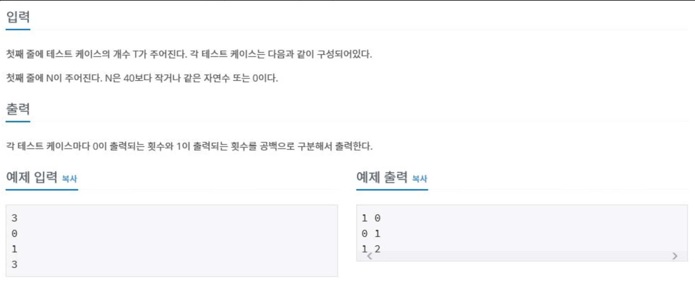

# 피보나치 함수
> 백준 온라인 저지\
> DP\
> 1003\
> https://www.acmicpc.net/problem/1003



## 요약
숫자 n이 주어지고, f(n)을 n번째 피보나치 수라고 할 때, f(n)을 구하기 위해 f(0)과 f(1)이 몇 번 호출됐는지 구하기

## 풀이
### 코드
```java
import java.io.*; 
public class Main {
    static int n1=0;
    static int n0=0;
    public static void main(String[] args) throws Exception {
        // TODO Auto-generated method stub
        BufferedReader br = new BufferedReader(new InputStreamReader(System.in));
        int testCase = Integer.parseInt(br.readLine());
        for(int i=0;i<testCase;i++){
            fibonacci(Integer.parseInt(br.readLine()));
            System.out.println(n0 + " " + n1);
            n1 = 0;
            n0 = 0;
        }
    }
 
    public static int fibonacci(int n){
        if(n==0){
            n0++;
            return 0;
        }else if(n==1){
            n1++;
            return 1;
        }else{
            return fibonacci(n-1)+fibonacci(n-2);
        }
    }
}
```
<Comment></Comment>