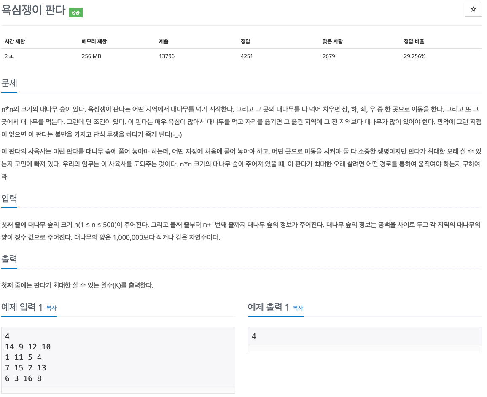

# 욕심쟁이 판다
> 백준 온라인 저지\
> DP\
> 1937\
> https://www.acmicpc.net/problem/1937

## 문제


## 요약
dp 문제 이다.\
N이 입력되고, N*N 배열이 입력된다.(bambooMap이라 하겠다.)\
문제에서 원하는 답은, bambooMap의 [0][0] 에서 [N-1][N-1]까지의 각 영역에서 주변 영역으로 가장 멀리 이동했을 때, 몇번이나 이동할 수 있는지를 찾으면 된다.(한 번 이동을 하루로 계산하기 때문에, 몇 번 이동했는지만 카운트 해도 된다.)\
(0, 0)에서 (N-1, N-1)까지 루프를 돌며 dfs 탐색을 하면 되지만, N*N번의 탐색을 하게 되면  시간제한에 걸리기 쉽다.\
때문에 한번 탐색한 곳은 liveMap에 기록해 두고 다음번엔 탐색하지 않고 넘어간다면 시간을 줄일 수 있다.\
예를 들어, \
&nbsp;&nbsp;&nbsp;&nbsp;&nbsp;&nbsp;&nbsp;&nbsp;1 2 3\
&nbsp;&nbsp;&nbsp;&nbsp;&nbsp;&nbsp;&nbsp;&nbsp;1 1 1\
&nbsp;&nbsp;&nbsp;&nbsp;&nbsp;&nbsp;&nbsp;&nbsp;1 1 1\
과 같은 입력이 주어졌을 때, (0, 0)부터 탐색을 하면\
&nbsp;&nbsp;&nbsp;&nbsp;&nbsp;&nbsp;&nbsp;&nbsp;(0, 0) => (0, 1) => (0, 2)\
이고, \
&nbsp;&nbsp;&nbsp;&nbsp;&nbsp;&nbsp;&nbsp;&nbsp;liveMap[0][0] = 3\
&nbsp;&nbsp;&nbsp;&nbsp;&nbsp;&nbsp;&nbsp;&nbsp;liveMap[0][1] = 2\
&nbsp;&nbsp;&nbsp;&nbsp;&nbsp;&nbsp;&nbsp;&nbsp;liveMap[0][2] = 1\
이 기록된다.\
이제 여기가 중요한데, (0, 1)을 탐색할 땐 이미 기록이 되어있으므로, dfs로 탐색할 필요 없이 그냥 liveMap[0][1]에 기록된 값을 사용하면 된다.
<br>
이런 식으로 bambooMap[0][0] ~ bambooMap[N-1][N-1] 을 모두 탐색하고, 그 중 가장 큰 값을 출력하면 된다.


## 코드
```java
import java.io.BufferedReader;
import java.io.InputStreamReader;

public class Main {
    static int N;
    static int[][] bambooMap;
    static int[][] move = {{-1, 0}, {0, 1}, {1, 0}, {0, -1}};
    static int[][] liveMap;

    public static void main(String[] args) throws Exception {
        // init
        BufferedReader br = new BufferedReader(new InputStreamReader(System.in));
        N = Integer.parseInt(br.readLine());
        bambooMap = new int[N][N];
        liveMap = new int[N][N];

        for(int i = 0; i < N; i++){
            String[] tmp = br.readLine().split(" ");
            for(int j = 0; j < N; j++){
                bambooMap[i][j] = Integer.parseInt(tmp[j]);
            }
        }

        //solve
        int ans = -1;
        for(int r = 0; r < N; r++){
            for(int c = 0; c < N; c++){
                int tmp = dfs(r, c, 0);
                ans = ans > tmp ? ans : tmp;
            }
        }
        
        //print answer
        System.out.println(ans);
    }

    static int dfs(int row, int col, int prevBambooCnt){
        if(bambooMap[row][col] <= prevBambooCnt) return 0;
        if(liveMap[row][col] > 0) return liveMap[row][col];

        //dfs
        int comp = 0;
        for(int[] dir : move){
            int newRow = row+dir[0];
            int newCol = col+dir[1];
            if(canMove(newRow, newCol)){
                int tmp = dfs(newRow, newCol, bambooMap[row][col]) + 1;
                comp = comp > tmp ? comp : tmp;
            }
        }
        comp = comp == 0 ? 1 : comp;
        return liveMap[row][col] = comp;
    }

    static boolean canMove(int row, int col){
        try{
            int nextBambooCnt = bambooMap[row][col];
            return true;
        }catch(Exception e){
            return false;
        }
    }
}
```
<comment></comment>