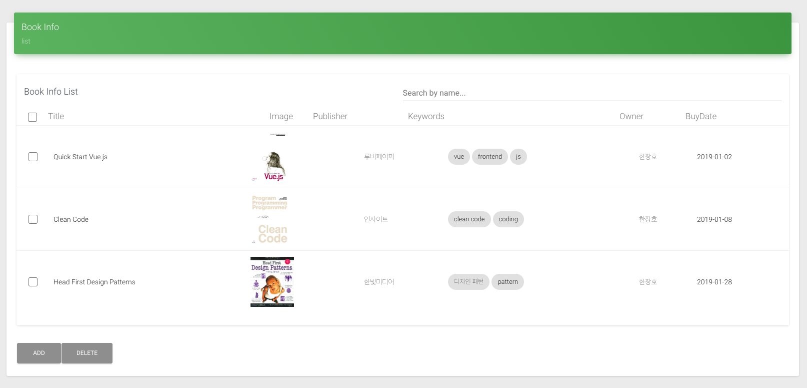

# 도서 관리 시스템

## 개발 목적
* 매 분기 책을 사며 팀에서 관리하는 책이 많아졌다.
* 따로 excel을 사용해서 관리했으나, 잘못하여 문서가 삭제되었다.
* 다시 excel을 만들려 하다, 최근 vuejs를 공부하고 있어서 실제 활용해 보기 위해 만들어보기로 했다.
## 주요 기능
* 책 추가
* 삭제
* 수정
* 키워드 관리
* 검색
    * 제목 별 검색
    * 키워드 별 검색
## 사용 기술
### front end
* vuejs
* vuex
* vue-router
* axios
#### style
* [Vue Material Dashboard](https://demos.creative-tim.com/vue-material-dashboard) 

### back end
* firebase
> 일단 firebase 를 사용.\
> 사내 서버에 db 설치하고 서버를 띄울 수 있도록 backend를 수정 할 예정.

<Comment></Comment>