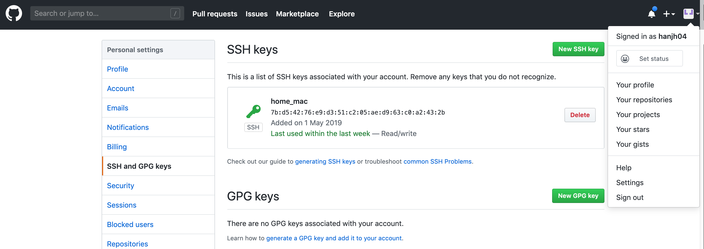
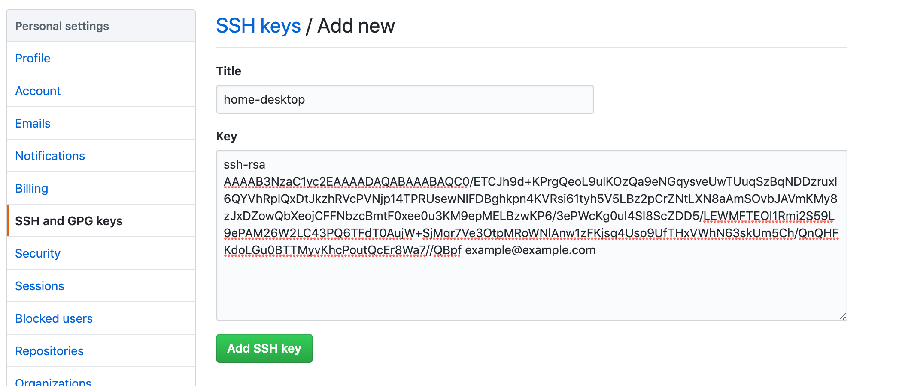
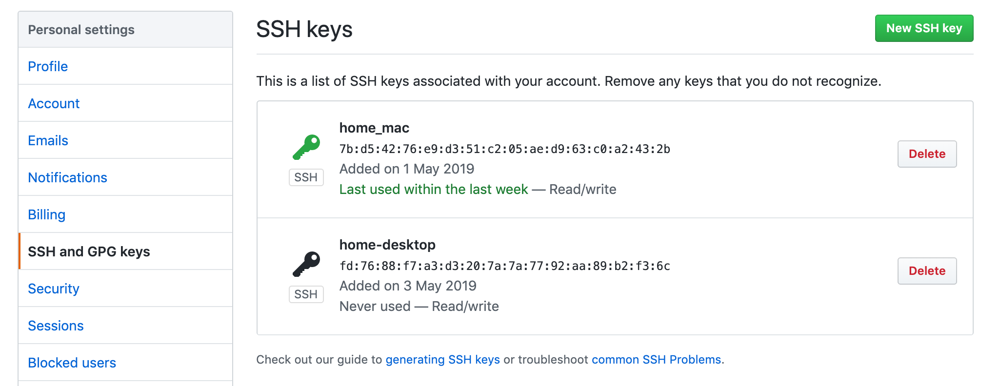

# github 로그인 없이 사용하는 방법에
> ssh 인증을 통해 github을 로그인 없이 사용하는 방법에 대해 알아보자!

## 방법
1. ssh 키 생성
```bash
$ ssh-keygen -t rsa -C "example@example.com"
Generating public/private rsa key pair.
Enter file in which to save the key (/Users/hanjangho/.ssh/id_rsa): unique_rsa_id # 중복 되지 않는 id 입력
Enter passphrase (empty for no passphrase): # 엔터
Enter same passphrase again: # 엔터
The keys randomart image is:
+---[RSA 2048]----+
|o.               |
|oo               |
|+ .              |
|+*.o   .   .     |
|+o=. ..oS . .    |
| oo ..o..o +  .  |
|..o* oo.o.+ +. E |
|o+. * ..o. *.+.  |
|+  . ..  .++Bo   |
+----[SHA256]-----+

# 확인
$ ls -al ~/.ssh
-rw-------   1 hanjangho  staff  1831  5  2 00:45 unique_rsa_id
-rw-r--r--   1 hanjangho  staff   401  5  2 00:45 unique_rsa_id.pub

# public key 확인
$ cat ~/.ssh/unique_rsa_id.pub
# key 내용 출력됨. 전체 복사
```
2. local ssh 설정하기
```bash
$ cd ~/.ssh/
$ vi config
# 편집
Host github.com-example
        HostName github.com
        User git
        IdentityFile ~/.ssh/unique_rsa_id
# 종료
```
3. github에 등록
    * 위에서 얻은 public key의 내용을 github에 등록한다.
    
    
    

4. local repository에 등록
* local git repository 에 아래와 같이 설정해준다.
    * url=git@github.com-example:{github 계정}/{repository name}.git
```sh
$ cd /your/git/repository/.git/
$ vi config
[core]
        repositoryformatversion = 0
        filemode = true
        bare = false
        logallrefupdates = true
        ignorecase = true
        precomposeunicode = true
[remote "origin"]
        url = git@github.com-hanjh04:hanjh04/toy.git
        fetch = +refs/heads/*:refs/remotes/origin/*
[branch "master"]
        remote = origin
        merge = refs/heads/master
```
5. 테스트


